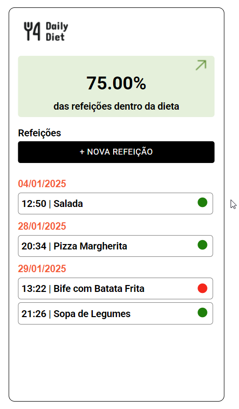
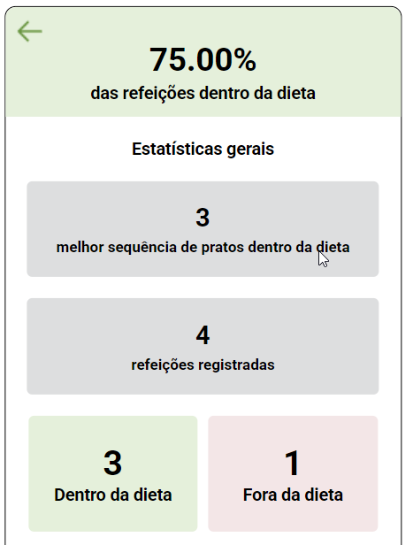
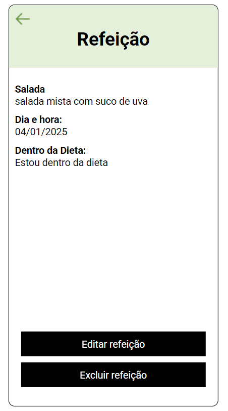

# rocketseat-nodejs-desafio2
- Nesse desafio foi desenvolvido uma API para controle de dieta diária, a Daily Diet API
- Segue orientações completas do curso Rocketseat sobre o desafio: https://efficient-sloth-d85.notion.site/Desafio-02-be7cdb37aaf74ba898bc6336427fa410

para rodar aplicação: npm run dev

## Sobre o Desafio

- Deve ser possível criar um usuário
- Deve ser possível identificar o usuário entre as requisições
- Deve ser possível registrar uma refeição feita, com as seguintes informações:
    
    *As refeições devem ser relacionadas a um usuário.*
    
    - Nome
    - Descrição
    - Data e Hora
    - Está dentro ou não da dieta
- Deve ser possível editar uma refeição, podendo alterar todos os dados acima
- Deve ser possível apagar uma refeição
- Deve ser possível listar todas as refeições de um usuário
- Deve ser possível visualizar uma única refeição
- Deve ser possível recuperar as métricas de um usuário
    - Quantidade total de refeições registradas
    - Quantidade total de refeições dentro da dieta
    - Quantidade total de refeições fora da dieta
    - Melhor sequência de refeições dentro da dieta
- O usuário só pode visualizar, editar e apagar as refeições o qual ele criou

## Alguns prints do aplicativo

- tela Home

- tela apresentação de estatística do app referente as refeições

- tela dos dados da refeição, onde podemos editar e excluir a refeição

